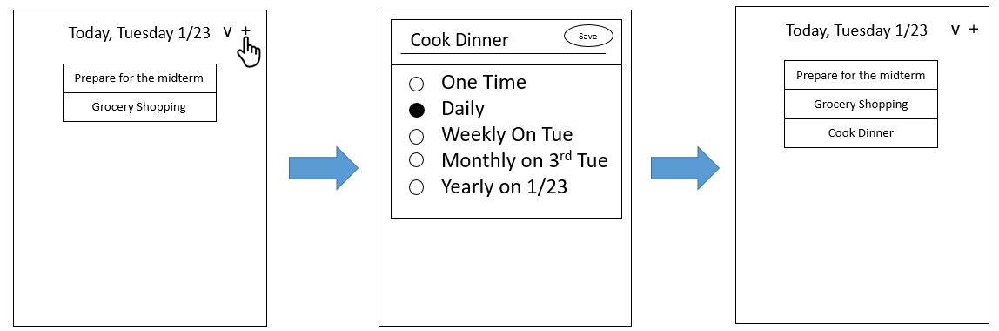
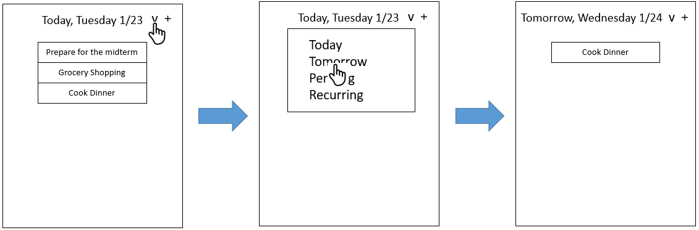
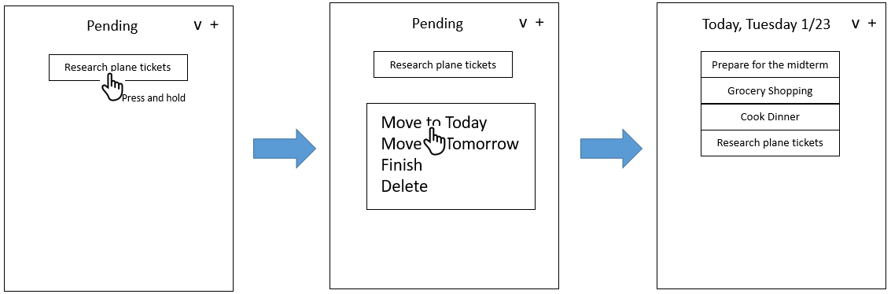
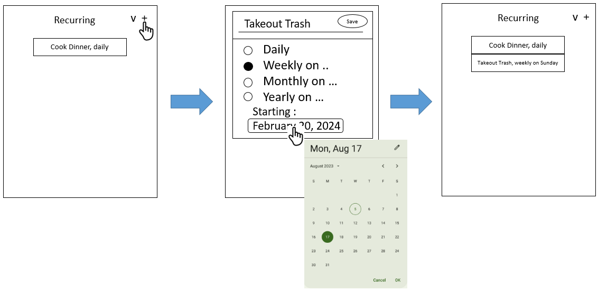
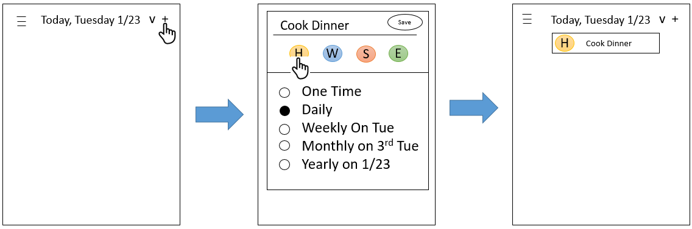
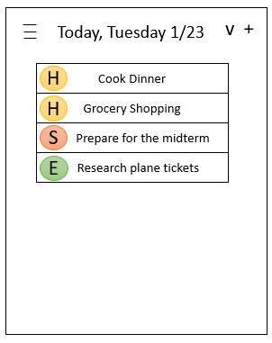
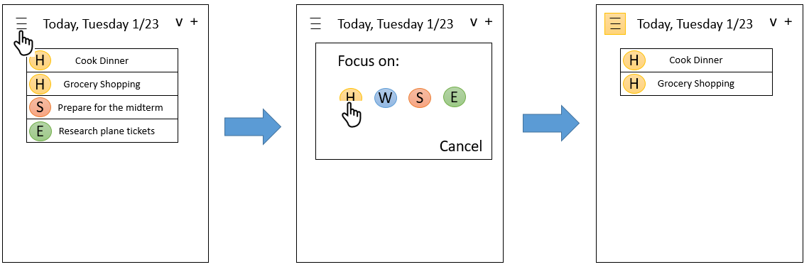
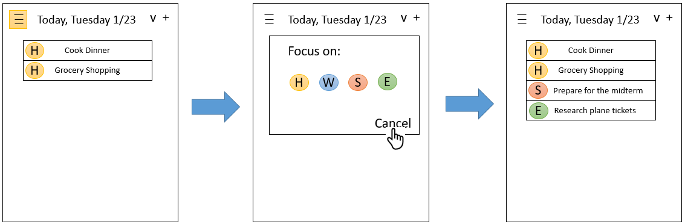

# User Stories

## End-to-End Scenario: Jessica Struggles, and becomes a serial planner  

### US1: Frequency of the goal(one-time, daily, weekly, monthly, yearly) (10hrs, High)  

As a user, I want to set the frequency of the goal   
So that the goal can be added as one-time, daily, weekly, monthly, or yearly.  
  
Given a daily goal “Cook Dinner”   
When I press “+“  
Then I Type in “Cook Dinner” and press Daily  
When I press Save  
Then the goal “Cook Dinner” shows in Today, Tomorrow, and Recurring views  

  

### US2: Categories/views for goals(Today, Tomorrow, Pending, Recurring) (9hrs, High)   

As a user, I want to have separate categories for the goals  
So that I can switch to Today, Tomorrow, Pending, or Recurring views.    
  
Given the goal “Cook Dinner” is in Tomorrow view  
When I press v  
Then I press Tomorrow  
And the view changes from Today to Tomorrow  
And “Cook Dinner” shows in Tomorrow view    
  
  
  
### US3: Move goals from one category/view to another (4hrs, Low)    
  
As a user, I want to be able to move goals from one category/view to another  
So that I can adjust their category to feed my needs.  
  
Given the goal “Research plane tickets” in Pending view  
And I want to move it to Today view  
When I press and hold “Research plane tickets”  
And I press Move to Today  
Then the goal “Research plane tickets” is moved to Today view  
  
  

### US4: Recurring goals (7hrs, Medium)  
  
As a user, I want to add a goal with start time and recurring frequency  
So that I can set the start time for recurring of the goal and recurring frequency(daily, weekly, monthly, yearly).  
  
Given a goal “Takeout Trash”   
And I want to recurring this goal weekly on Sunday  
When I press +  
Then I press Weekly on …  
When I press February 20,2024 and choose February 25,2024  
And I press Save  
Then the goal “Takeout Trash, weekly on Sunday” shows in Recurring  
  
  

## End-to-End Scenario: Jessica becomes an expert Juggler  

### US5: Tag goals with a work context (Home, Work, School, or Errands) (8hrs, High)  
  
As a user, I want to be able to tag my goal with a work context  
So that I know what my to-do is related to (e.g., Home, Work, School, or Errands).  

Given “Cook Dinner” is a goal for “Home”   
When I press +  
Then I type in “Cook Dinner” and press H and press Daily  
When I press Save  
Then the goal “H Cook Dinner” shows in Today, Tomorrow, and Recurring views  

  

### US6: Group goals by work context instead of order (4hrs, Low)  

As a user, I want my goals to be grouped by work context   
So that my to-do’s are more organized.  

Given a list of goals in the Today view  
When I open the Today view  
Then all goals are grouped by work context  

  

### US7: Choose context focus with a Focus mode menu (8hrs, Medium)  

As a user, I want to have a Focus mode  
So that the app shows just the goals I want to finish right now.  

Given Today view have two “Home” goals, one “School” goal and one “Errands” goal  
When I press 三   
And I press H  
Then Today view shows two “Home” goals and archives other goals.  
And 三 changes to 三 (yellow)  

  

### US8: Exit the Focus mode menu (2hrs, Medium)  

As a user, I want to be able to exit the Focus mode   
So that I can see my entire goal list when I need to.  

Given Today view shows two “Home” goals and archives other goals.  
When I press 三 (yellow)  
And I press Cancel  
Then Today view shows two “Home” goals, one “School” goal and one “Errands” goal  
And 三 (yellow) changes to 三  

  

