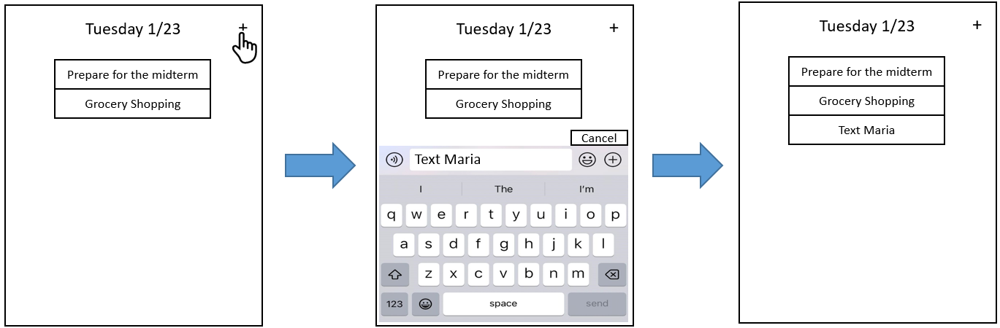
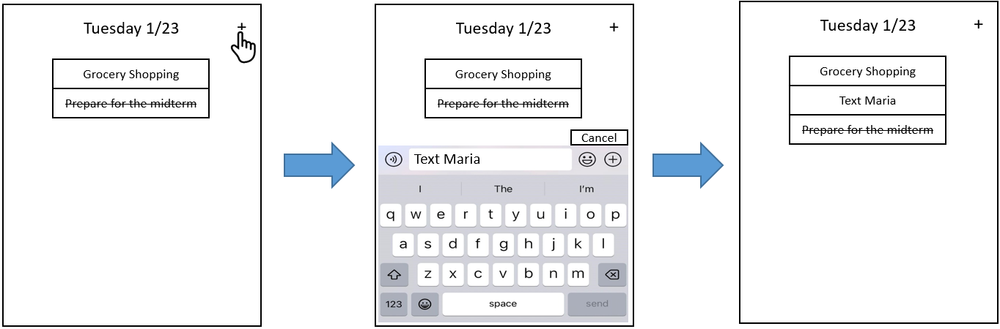
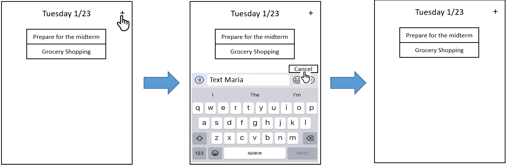
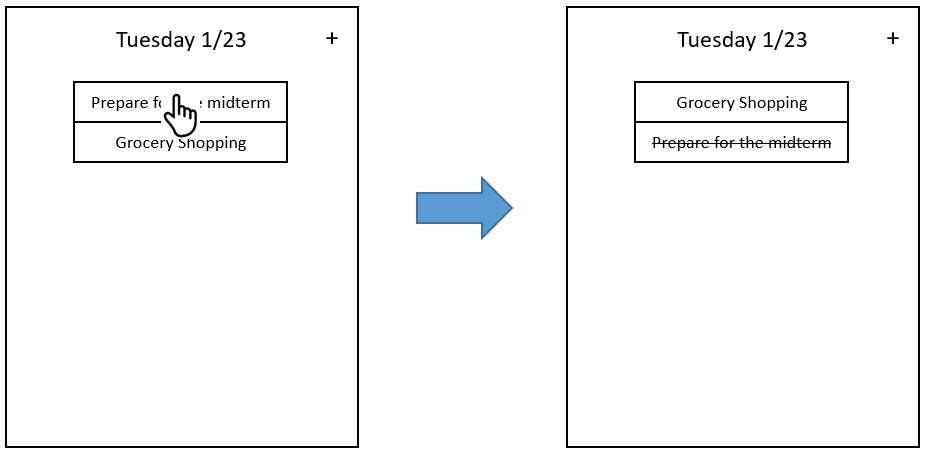
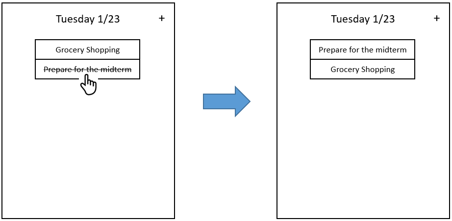

# User Stories

### 1. Current date (16hr, Medium)  

As a user with a lot of goals  
I want to know the current day of the week and the date   
So that I can set my daily goals based on the current date  

Scenario 1: When the current day passed  
Given the current date is Mon 1/23  
And Goal1 is crossed  
And Goal2 is still there  
When the current date has passed  
Then the current date should become to Tue 1/24  
And Goal1 has been removed  
And Goal2 will have remained  

  

### 2. Add goal (25hr, High)  

As a user with a lot of goals   
I want to add new goals to the list of goals  
So that I can see my new daily goals on the list  

Scenario 1: When there is no goal in the list  
Given the current date is Mon 1/23  
And there is no goal in the list  
When I add a new goal  
Then the new goal will be shown after the date which is the top of the goal list  

  

Scenario 2: When there are some uncrossed goals in the list  
Given there are some uncrossed goals in the list  
When I add a new goal   
Then the new goal will be shown after all uncrossed goals in the list    

  

Scenario 3: When there are some uncrossed goals in the list and some crossed goals in the list  
Given there are some uncrossed goals in the list  
And there are some crossed goals in the list  
When I add a new goal   
Then the new goal will be shown after all uncrossed goals in the list and before all crossed goals in the list    

  

Scenario 4: When there are some crossed goals in the list  
Given there are some crossed goals in the list  
When I add a new goal   
Then the new goal will be shown before all crossed goals in the list    

  

Scenario 5: When I want to cancel creating goal   
Given there are some goals in the list  
When I tap the button “+” and I want to cancel creating goal   
Then I tap “cancel” to go back to the goal list    

  

### 3. Move goal (2hr, High)  

As a user with a lot of goals  
I want to cross a goal when I reach it  
So that I can see the goal I reached has been crossed and moved to the bottom of the list  

Scenario 1: When there are some goals  
Given there are Goal1, Goal2, Goal3 in the goals list  
When I tap "Goal1"  
Then Goal1 will be crossed  
And Goal1 will be moved to the bottom of the list  
And Goal2 will be moved to the top of the list  
And Goal3 will be moved to the second place on the list  

  

### 4. Return crossed goal (3 hrs, High)   
As a user with a lot of goals  
I want to put the accidentally crossed goal back to incomplete  
So that I can move the crossed goal by mistake back to incomplete   

Scenario 1: Return incomplete goal from the complete list  
Given there "Goal1" accidentally be crossed  
When I want to return “Goal1” back to incomplete goal list  
And I tap crossed “Goal1”  
And Goal1 will be moved back to the original place in the incomplete goal list  

  

## Tasks for First Iteration  

US2-task1: addGoalsAction (3 hr)
- Task will involve some kind of “+” icon in the main view container (the first thing the user sees) and involve communicating with an event listener which will trigger a callback function to be called which corresponds to some kind of prompt popping up. (2 hr?)

US2-task2: addGoalsPrompt (4 hrs)
- Some method will get called by the event listener which initiates a prompt popping up in the view container. Note that a todo item shouldn’t take more than one line so may involve truncation (or limit number of characters twitter style)

US2-task3: storeGoalsData (3 hrs)
- The prompt will take input from the user, (maybe some kind of Android API can help with this), once user hits enter this data gets sent back (presentation layer (e.g. maybe calls displayGoals again to display new data/goals) -> business logic (to format for storing) -> data layer (to store)). 

US2-task4: displayGoals (3 hrs)
- This lets the presentation layer to extract data from business logic and then pass it into views (in presentation layer may involve the use of RecyclerView and an Adapter which may take getting some familiarity with since Goals will be a list that will not be static but change upon user input/deletion).
- (Maybe this happens when the user first opens the app or when they add a new goal)
- Also may need to enable scrolling somehow in the UI.

US2-task5: noGoals (2 hr)
- If no goals are present in the database/storage, then we display a default message in the view with something like “Add your most important thing”

US2-task6: Implement a database for goals for persistence storage (6 hrs)
- This may involve getting familiar with SQL and a database such as MySQL, PostgreSQL, or SQLite (for relational databases). 
https://developer.android.com/training/data-storage/sqlite

US2-task7: Testing (unit tests for business logic, integration tests, UI tests) (6 hrs)

## Tasks for Second Iteration

US1-task1: getCurrentDate (3 hrs)
- This task will get the current date and time depending on getUserTimezone, will involve understanding some sort of Android/Java Date API (1-2 hrs?), and the formatting for dates. Also once we have the date and time we want to keep the date set to the previous day if it is before 2 AM in the users timezone. After 2 AM it will display the actual current date.

US1-task2: displayCurrentDate (3 hrs)
- Once we have the date it will then have to get sent to the UI (create a view for it and design) and connect this view with the activity/fragment(1-2 hr?).

US1-task3: getUserTimezone (3 hrs)
- This will involve interacting with the user phones through some kind of Android API. Getting their timezone configuration for the users phone (2-3 hrs?)

US1-task4: timeSync (3 hr)
- Something that refreshes/shows the correct date no matter the time. Maybe some kind of loop that refreshes the date in the view with the new date while the application is active (1-2 hr?)

US1-task6: Testing (unit tests for business logic, integration tests, UI tests) (4 hrs)

US3-task1: moveGoal (3 hrs)
- Connect event listener for a specific goal for all goals. (so each goal will have an event listener). This will wait for the user to tap the goal. Now if it is active, it will mark the goal as inactive, this information will get updated, from presentation layer down to business logic for storage.
If goal is inactive then the goal will become active and have a similar process as above.
We will have both an active list and an inactive list, so in the view a goal will be moved when tapped and become MIT in its corresponding list.
At the end of this process maybe call displayGoals?

US3-task2: markGoalInactive (2 hr)
- If the Goal is marked as inactive in the business logic, then we also want to render this to the user, this will involve creating a view specific to Goals that are inactive such that they are crossed out in the view. (1 hr?)

US3-task3: deleteInactiveGoal (2 hrs)
- If the clock turns to 2 am, then we want the inactive goals to disappear, this could involve a function in timeSync that will check the time and for all inactive goals we will delete them from the business logic in storage/database. This will also involve calling displayGoals again to refresh the goal list in the view.

US3-task4: Testing (unit tests for business logic, integration tests, UI tests) (4 hrs)

